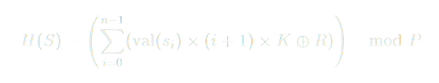

## 1. Mathematical Function

We define a **256-bit** hash function `H(S)` for a string `S`. Let `S` have characters `s_0, s_1, …, s_(n-1)`. Then:

```



H(S) = (sum_{i=0}^{n-1} ((val(s_i) * (i+1) * K) XOR R)) mod P
```

Where:
1. `val(s_i)` is the ASCII value of the character `s_i`.
2. `(i+1)` ensures positions affect the result differently (simple order dependence).
3. `K` is a 256-bit **“golden-ratio-like”** constant used to mix bits.
4. `R` is another 256-bit constant, used to **XOR** every term for extra diffusion.
5. `P` is a **large 256-bit prime**. We use the well-known **secp256k1** prime:
```
P = 2^256 - 2^32 - 977
```

### Constants

- **`K`** (256-bit), repeated “golden ratio”:
```
0x9e3779b97f4a7c159e3779b97f4a7c159e3779b97f4a7c159e3779b97f4a7c15
```

- **`R`** (256-bit), repeated “random-ish” constant:
```
0xf39cc0605cedc835f39cc0605cedc835f39cc0605cedc835f39cc0605cedc835
```

- **`P`** (256-bit prime):
```
0xFFFFFFFFFFFFFFFFFFFFFFFFFFFFFFFFFFFFFFFFFFFFFFFFFFFFFFFEFFFFFC2F
```

Each of these fits in **256 bits**. We store them as four 64-bit words in the source code.

---

## Why These Choices? (Proof Sketch / Rationale)

While not a formal cryptographic proof, the selection of `K`, `R`, and `P` is guided by **well-known principles**:

- **`K`**: The 64-bit constant `0x9e3779b97f4a7c15` is widely used for bit-mixing (often called a “golden ratio” constant). Extending it by concatenation to 256 bits produces a uniform, high-entropy constant for multiplication.  
- **`R`**: A second constant ensures an **XOR scramble** after multiplication by `K`. This injects an extra layer of non-linearity.  
- **`P`**: By taking the result modulo `P` with a **large prime** near `2^256`, we avoid the biases that come from working in a power-of-two modulus. Using the **Bitcoin secp256k1** prime is a standard practice in elliptic curve cryptography, known to be robust and free of small prime factors.  

Collectively, these steps help **disperse** input bits and **reduce collisions**. The operations (`×`, `XOR`, `mod P`) cover linear and non-linear transformations that are common in hash functions.

> **Note**: For a production-grade cryptographic hash, a **fully vetted** design (e.g., SHA-256, SHA-3) is recommended. The approach here is mainly illustrative.

---

## Implementation Details

Below is the **C implementation** of this 256-bit hash. It:

- Maintains 256-bit values as **four 64-bit words** in an array.  
- Implements **basic big-integer** addition, subtraction, multiplication, and modulo operations.  
- Uses the described formula directly on the characters of the input string.

### Core Big-Integer Operations

**1. Addition (`add_256`)**  
Adds two 256-bit numbers (`a`, `b`) with carry handling:
```c
static void add_256(uint64_t r[4], const uint64_t a[4]) {
  __uint128_t c = 0; 
  for(int i=0; i<4; i++) {
    __uint128_t s = ((__uint128_t)r[i] + a[i] + c);
    r[i] = (uint64_t)s;
    c = s >> 64;
  }
}
```

### Compilation & Usage

Compile with:
```bash
gcc seytan256.c -o seytan256
```

Run:
```bash
./seytan256 hello
```

Output is a **64-hex-digit** number representing the hash.

---

## Conclusion

- **Mathematical Approach**: Combines integer multiplication, XOR, and a **prime modulus** to produce a 256-bit result.  
- **Implementation**: Demonstrates big-integer arithmetic in C (managing 256-bit operations via 64-bit arrays).  
- **Security Note**: While it uses patterns from cryptographic primitives, this code **is not** a peer-reviewed cryptographic hash. For real security, use well-established functions (SHA-2, SHA-3, etc.).


